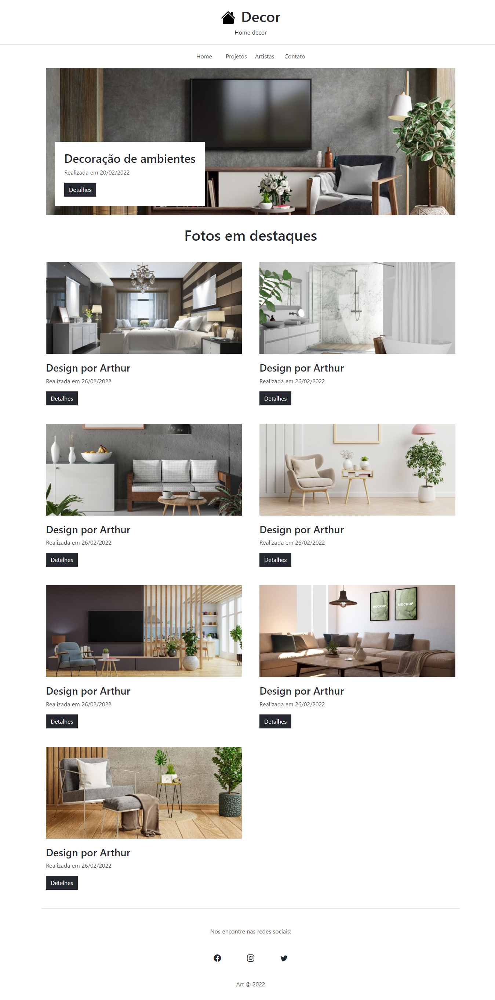

Sites com bootstrap, projeto 1: Site de Galeria

Durante o curso de bootstrap5 foram desenvolvidos alguns projetos de sites. Este é o primeiro desenvolvido com o bootstrap neste curso, onde foram trabalhados layouts e utilização de icones:

